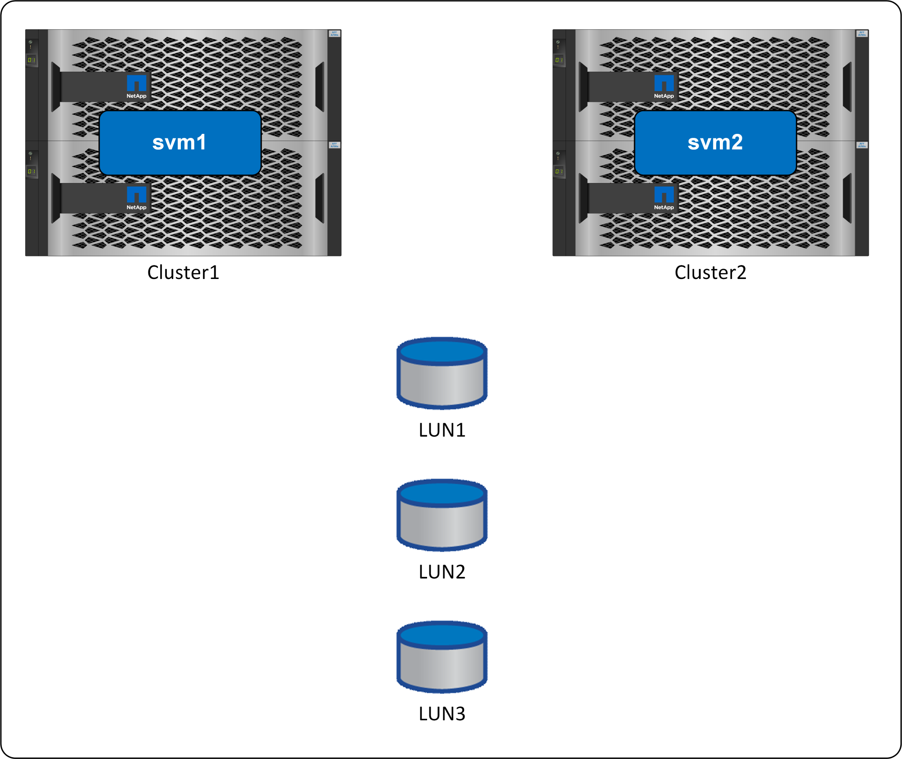

= Replicación
:allow-uri-read: 

La sincronización activa de SnapMirror (antes conocida como continuidad empresarial de SnapMirror o SM-bc) permite que aplicaciones y bases de datos individuales de SQL Server continúen funcionando en caso de producirse cualquier interrupción, con recuperación tras fallos transparente del almacenamiento sin intervención manual.

== Replicación

La sincronización activa (SM-AS) de SnapMirror se basa en la sincronización síncrona de SnapMirror. Ambos pueden ofrecer una replicación síncrona de datos con un objetivo de punto de recuperación=0, pero SM-AS lleva la solución aún más lejos proporcionando una disponibilidad de objetivo de tiempo de recuperación casi cero para los datos de SAN. Esto se logra mediante una automatización que gestiona rutas SAN para que los datos estén siempre disponibles. ONTAP gestiona automáticamente los errores de sitio, controladora y comunicación.

== Arquitectura

La sincronización activa de SnapMirror proporciona LUN que existen en dos sitios diferentes. En condiciones de funcionamiento normales, no hay «origen» ni «destino». La dirección es bidireccional. La controladora local realizará el servicio de todas las operaciones de I/O de lectura dirigidas sobre una ruta de LUN determinada mediante la copia local de los datos. Todas las escrituras se replicarán en el partner remoto, además de escribirse en local antes de reconocerse.

image:../media/smas-overview.png["Información general sobre sincronización activa de SnapMirror"]

Lógicamente, el comportamiento es como un único conjunto de LUN. I/O puede dirigirse a estos LUN lógicos a través de rutas SAN que existen en dos clústeres diferentes, pero los datos siempre son los mismos. El comportamiento de I/O es simétrico, lo cual es fundamental para muchas configuraciones de aplicaciones activo-activo.

== Gestión de rutas

Existen dos enfoques para la topología de red síncrona de SnapMirror: Uniforme y no uniforme. La consideración clave a la hora de elegir entre acceso uniforme y no uniforme es si puede o debe ampliar la SAN a través de los sitios. La sincronización activa de SnapMirror se puede utilizar en ambas situaciones.

== Hardware de almacenamiento

Al contrario que otras soluciones de recuperación ante desastres del almacenamiento, SnapMirror Active Sync ofrece una flexibilidad de plataforma asimétrica. No es necesario que el hardware de cada sitio sea idéntico. Esta funcionalidad permite ajustar el tamaño adecuado del hardware que se utiliza para dar soporte a SnapMirror de sincronización activa. El sistema de almacenamiento remoto puede ser idéntico al sitio principal si necesita soportar una carga de trabajo de producción completa, pero si un desastre provoca una reducción de I/O, es posible que un sistema más pequeño en el sitio remoto sea más rentable.

== Mediador ONTAP

ONTAP Mediator es una aplicación de software que se descarga del sitio de soporte de NetApp y normalmente se implementa en una máquina virtual.

Para obtener información sobre los pasos de planificación y configuración, consulte link:https://docs.netapp.com/us-en/ontap/snapmirror-active-sync/["Documentación de ONTAP en sincronización activa de SnapMirror"] .
