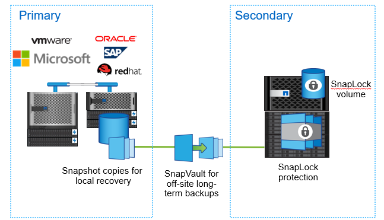

= Seguridad de la base de datos
:allow-uri-read: 

[role="lead"]
La seguridad de la base de datos siempre ha sido prioridad y DBA y la organización imponen puntos de control de endurecimiento para permitir que solo el usuario tenga acceso al servidor y a la base de datos. Desde la aplicación regular de parches de servidor, la configuración de firewall, la eliminación de invitado genérico o acceso público y la concesión de un permiso mínimo al usuario limitado para ejecutar aplicaciones o ejecutar consultas de informes ad hoc son parte de la protección del ecosistema empresarial.

Al aumentar los casos de ransomware o amenazas internas, los datos empresariales y los backups deben protegerse y deberían poder recuperarse rápidamente en un orden constante en caso de ataques maliciosos. Los atacantes aún pueden encontrar formas de secuestrar datos.
ONTAP ofrece una variedad de funcionalidades para proteger los datos en NAS y SAN.

ONTAP permite realizar backups de volúmenes flexibles en una empresa de SnapLock o un volumen de cumplimiento de normativas de SnapLock mediante la creación de una relación de SnapMirror entre un volumen de FlexVol como origen y un volumen de SnapLock como destino. Las copias Snapshot realizadas en backups en un sistema de almacenamiento secundario están protegidas contra modificaciones o eliminación hasta su fecha de retención con tecnología SnapLock en la política de SnapMirror asociada con una relación en la que el número de copias de Snapshot se define para una etiqueta de snapmirror en particular conservada en el volumen de SnapLock de destino.Para restaurar una copia Snapshot que contiene datos de LUN, puede realizarse en volúmenes distintos de SnapLock mediante la operación de restauración de snapmirror. En ONTAP 9.13.1, una copia de FlexClone se puede crear especificando un tipo de SnapLock como no snaplock. Para obtener más información sobre SnapLock, consulte link:https://docs.netapp.com/us-en/ontap/snaplock/["aquí"].

Copias Snapshot a prueba de manipulaciones o bloqueo de copias de instantáneas: La copia Snapshot es una forma rápida de proteger y restaurar bases de datos. Un atacante puede eliminar copias snapshot, que podrían haber sido la última opción para restaurar una base de datos en caso de que los datos resulten dañados. Al habilitar copias Snapshot a prueba de manipulaciones, la copia Snapshot se bloquea en un sistema ONTAP primario o secundario para evitar que un administrador malintencionado o que no sea de confianza eliminen las snapshots durante un período determinado. La función de copias snapshot a prueba de manipulaciones está disponible en ONTAP 9.12.1 y requiere la licencia de SnapLock y la inicialización de reloj de cumplimiento de normativas.

ONTAP tiene una función de verificación multiadministrador (MAV), lo que significa que ningún administrador tiene un privilegio completo para eliminar copias Snapshot o modificar volúmenes. Esto puede actuar como seguridad adicional para evitar que los administradores que no son de confianza vuelvan a manipular volúmenes o copias Snapshot.
