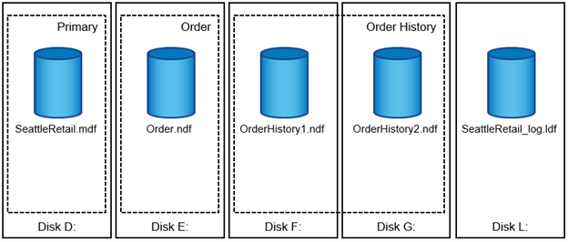
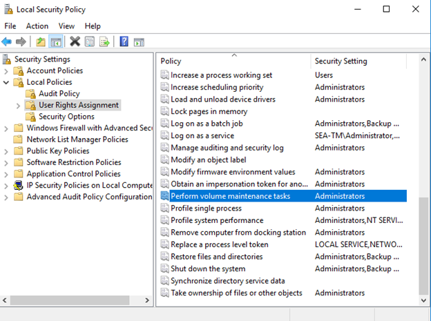
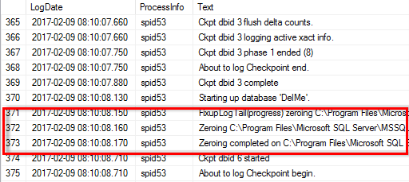
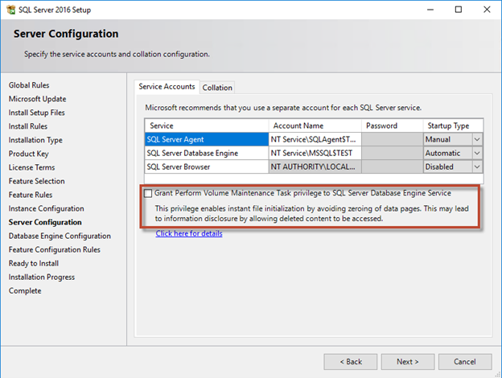

= Archivos y grupos de archivos de bases de datos de Microsoft SQL Server
:allow-uri-read: 

[role="lead"]
Una base de datos de SQL Server es una colección de objetos que permite almacenar y manipular datos.

En teoría, SQL Server (64 bits) admite 32.767 bases de datos por instancia y 524.272TB GB de tamaño de base de datos, aunque la instalación típica suele tener varias bases de datos. Sin embargo, el número de bases de datos que SQL Server puede manejar depende de la carga y el hardware. No es raro ver instancias de SQL Server que alojan docenas, cientos o incluso miles de pequeñas bases de datos.

Cada base de datos consta de uno o más archivos de datos y uno o varios archivos de registro de transacciones. El log de transacciones almacena la información sobre las transacciones de la base de datos y todas las modificaciones de datos realizadas por cada sesión. Cada vez que se modifican los datos, SQL Server almacena suficiente información en el log de transacciones para deshacer (realizar rollback) o rehacer (reproducir) la acción. Un registro de transacciones de SQL Server es una parte esencial de la reputación de SQL Server en cuanto a integridad y solidez de los datos. El registro de transacciones es vital para las capacidades de atomicidad, consistencia, aislamiento y durabilidad (ACID) de SQL Server. SQL Server escribe en el registro de transacciones tan pronto como se producen cambios en la página de datos. Cada sentencia de lenguaje de manipulación de datos (DML) (por ejemplo, SELECT, INSERT, UPDATE o DELETE) es una transacción completa, y el registro de transacciones se asegura de que se realice toda la operación basada en juegos, asegurándose de la atomicidad de la transacción.

Cada base de datos tiene un archivo de datos primario, que, por defecto, tiene la extensión .mdf. Además, cada base de datos puede tener archivos de base de datos secundarios. Esos archivos, por defecto, tienen extensiones .ndf.

Todos los archivos de base de datos se agrupan en grupos de archivos. Un grupo de archivos es la unidad lógica, que simplifica la administración de la base de datos. Permiten la separación entre la ubicación de objetos lógicos y los archivos físicos de la base de datos. Al crear las tablas de objetos de base de datos, especifique en qué grupo de archivos se deben colocar sin preocuparse por la configuración del archivo de datos subyacente.

La capacidad de colocar varios archivos de datos dentro del grupo de archivos permite distribuir la carga entre diferentes dispositivos de almacenamiento, lo que ayuda a mejorar el rendimiento de I/O del sistema. Por el contrario, el registro de transacciones no se beneficia de los varios archivos, ya que SQL Server escribe en el registro de transacciones de forma secuencial.

La separación entre la ubicación de objetos lógicos en los grupos de archivos y los archivos físicos de la base de datos le permite ajustar el diseño del archivo de la base de datos, aprovechando al máximo el subsistema de almacenamiento. Por ejemplo, los proveedores de software independientes (ISV) que ponen en marcha sus productos en diferentes clientes pueden ajustar el número de archivos de base de datos en función de la configuración I/O subyacente y la cantidad esperada de datos durante la etapa de puesta en marcha. Estos cambios son transparentes para los desarrolladores de aplicaciones, que colocan los objetos de base de datos en los grupos de archivos en lugar de en los archivos de base de datos.

TIP: *NetApp recomienda* evitar el uso del grupo de archivos primario para cualquier cosa excepto objetos del sistema. La creación de un grupo de archivos independiente o un conjunto de grupos de archivos para los objetos de usuario simplifica la administración de la base de datos y la recuperación ante desastres, especialmente en el caso de bases de datos grandes.

Puede especificar el tamaño inicial del archivo y los parámetros de crecimiento automático en el momento de crear la base de datos o agregar nuevos archivos a una base de datos existente. SQL Server utiliza un algoritmo de relleno proporcional al elegir en qué archivo de datos debe escribir los datos. Escribe una cantidad de datos proporcionalmente al espacio libre disponible en los archivos. Cuanto mayor sea el espacio libre del archivo, más escrituras gestionará.

TIP: *NetApp recomienda* que todos los archivos en un solo grupo de archivos tengan los mismos parámetros iniciales de tamaño y crecimiento automático, con el tamaño de crecimiento definido en megabytes en lugar de porcentajes. Esto ayuda al algoritmo de relleno proporcional a equilibrar de forma uniforme las actividades de escritura en los archivos de datos.

Cada vez que SQL Server crece los archivos, llena el espacio recién asignado en los archivos con ceros. Este proceso bloquea todas las sesiones que necesitan escribir en el archivo correspondiente o, en caso de crecimiento del log de transacciones, generar registros de log de transacciones.

SQL Server siempre pone a cero el registro de transacciones y ese comportamiento no se puede cambiar. Sin embargo, puede controlar si los archivos de datos están a cero habilitando o deshabilitando la inicialización instantánea de archivos. La activación de la inicialización instantánea de archivos ayuda a acelerar el crecimiento de los archivos de datos y reduce el tiempo necesario para crear o restaurar la base de datos.

Un pequeño riesgo de seguridad está asociado con la inicialización instantánea de archivos. Cuando esta opción está activada, las partes no asignadas del archivo de datos pueden contener información de los archivos del sistema operativo eliminados anteriormente. Los administradores de bases de datos pueden examinar estos datos.

Puede activar la inicialización instantánea de archivos agregando el permiso SA_MANAGE_VOLUME_NAME, también conocido como “Realizar tarea de mantenimiento de volúmenes”, a la cuenta de inicio de SQL Server. Puede hacerlo en la aplicación de gestión de políticas de seguridad local (secpol.msc), como se muestra en la siguiente figura. Abra las propiedades del permiso “Realizar tarea de mantenimiento de volúmenes” y agregue la cuenta de inicio de SQL Server a la lista de usuarios allí.

Para comprobar si el permiso está habilitado, puede utilizar el código del siguiente ejemplo. Este código establece dos indicadores de rastreo que obligan a SQL Server a escribir información adicional en el log de errores, crear una base de datos pequeña y leer el contenido del log.

....
DBCC TRACEON(3004,3605,-1)

GO

CREATE DATABASE DelMe

GO

EXECUTE sp_readerrorlog

GO

DROP DATABASE DelMe

GO

DBCC TRACEOFF(3004,3605,-1)

GO
....
Cuando la inicialización instantánea de archivos no está activada, el registro de errores de SQL Server muestra que SQL Server pone a cero el archivo de datos de mdf además de poner a cero el archivo log ldf, como se muestra en el siguiente ejemplo. Cuando se activa la inicialización instantánea del archivo, sólo se muestra la puesta a cero del archivo log.

La tarea de mantenimiento de volúmenes se simplifica en SQL Server 2016 y más tarde se proporciona como opción durante el proceso de instalación. Esta figura muestra la opción para otorgar al servicio del motor de base de datos SQL Server el privilegio para realizar la tarea de mantenimiento de volúmenes.

Otra opción importante de la base de datos que controla los tamaños de los archivos de la base de datos es la reducción automática. Cuando esta opción está habilitada, SQL Server reduce regularmente los archivos de la base de datos, reduce su tamaño y libera espacio al sistema operativo. Esta operación consume muchos recursos y rara vez es útil porque los archivos de la base de datos vuelven a crecer después de un tiempo cuando llegan nuevos datos al sistema. La reducción automática nunca debe estar activada en la base de datos.
