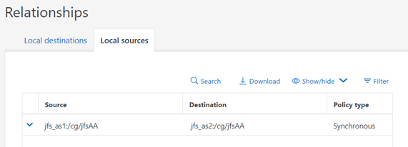

= Sitio preferido
:hardbreaks:
:allow-uri-read: 
:icons: font
:linkattrs: 
:imagesdir: ../media/

[role="lead"]
El comportamiento de sincronización activa de SnapMirror es simétrico, con una excepción importante: La configuración de sitio preferida.

La sincronización activa de SnapMirror considerará que un sitio es el «origen» y el otro el «destino». Esto implica una relación de replicación unidireccional, pero esto no se aplica al comportamiento de E/S. La replicación es bidireccional y simétrica, y los tiempos de respuesta de I/O son los mismos en cualquier lado del espejo.

La `source` designación controla el sitio preferido. Si se pierde el enlace de replicación, las rutas de LUN en la copia de origen seguirán sirviendo datos mientras las rutas de LUN en la copia de destino dejarán de estar disponibles hasta que se restablezca la replicación y SnapMirror vuelva a entrar en un estado síncrono. A continuación, las rutas reanudarán el servicio de datos.

La configuración de origen/destino se puede ver a través de SystemManager:

O en la CLI:

....
Cluster2::> snapmirror show -destination-path jfs_as2:/cg/jfsAA

                            Source Path: jfs_as1:/cg/jfsAA
                       Destination Path: jfs_as2:/cg/jfsAA
                      Relationship Type: XDP
                Relationship Group Type: consistencygroup
                    SnapMirror Schedule: -
                 SnapMirror Policy Type: automated-failover-duplex
                      SnapMirror Policy: AutomatedFailOverDuplex
                            Tries Limit: -
                      Throttle (KB/sec): -
                           Mirror State: Snapmirrored
                    Relationship Status: InSync
....
La clave es que la fuente es la máquina virtual de almacenamiento SVM en cluster1. Tal como se ha mencionado anteriormente, los términos «origen» y «destino» no describen el flujo de los datos replicados. Ambos sitios pueden procesar una escritura y replicarla en el sitio opuesto. De hecho, ambos clústeres son orígenes y destinos. El efecto de designar un clúster como origen simplemente controla qué clúster sobrevive como sistema de almacenamiento de lectura y escritura si se pierde el enlace de replicación.
