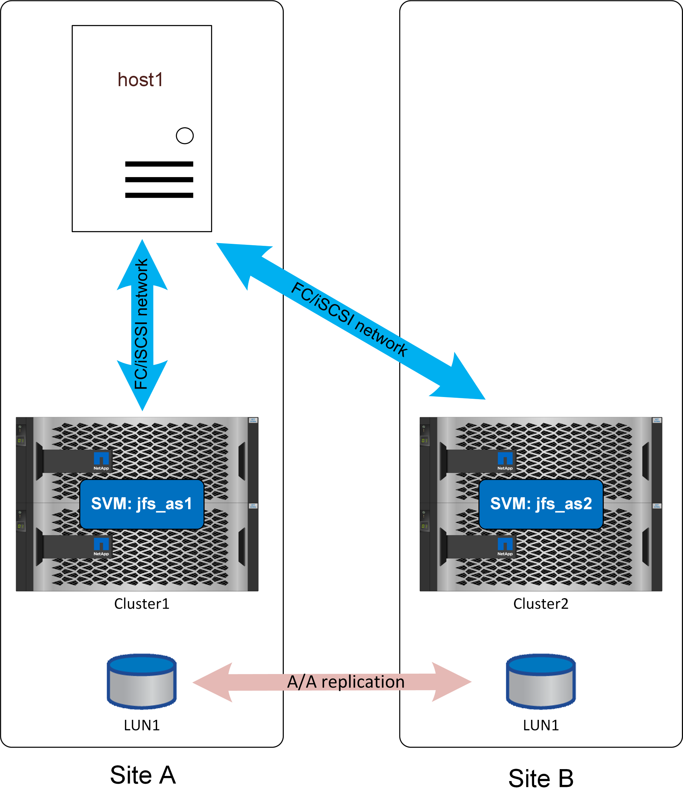

= Descripción general
:hardbreaks:
:allow-uri-read: 
:icons: font
:linkattrs: 
:imagesdir: ../media/

[role="lead"]
SQL Server se puede configurar para que funcione con la sincronización activa de SnapMirror de varias maneras. La respuesta correcta depende de la conectividad de red disponible, los requisitos de RPO y los requisitos de disponibilidad.

== Instancia independiente de SQL Server

Las mejores prácticas para la distribución de archivos y la configuración del servidor son las mismas que se recomiendan en link:mssql-storage-considerations.html["SQL Server en ONTAP"] la documentación.

Con una configuración independiente, SQL Server sólo podría ejecutarse en un sitio. Presumiblemente link:mssql-dr-smas-uniform.html["uniforme"]se utilizaría el acceso.

Gracias a un acceso uniforme, un fallo de almacenamiento en cualquiera de los sitios no interrumpía las operaciones de la base de datos. Un fallo completo del sitio en el sitio que incluyera el servidor de la base de datos, por supuesto, daría lugar a una interrupción del servicio.

Algunos clientes podrían configurar un sistema operativo que se ejecute en el sitio remoto con una configuración de SQL Server preconfigurada, actualizada con una versión de compilación equivalente a la de la instancia de producción. La conmutación por error requeriría activar esa instancia independiente de SQL Server en la ubicación alternativa, detectar LAS LUN e iniciar la base de datos. El proceso completo puede automatizarse con el cmdlet de Windows PowerShell ya que no es necesario realizar operaciones en el almacenamiento.

link:mssql-dr-smas-nonuniform.html["No uniforme"] también se podía utilizar el acceso, pero el resultado sería una interrupción en la base de datos si se hubiera producido un error en el sistema de almacenamiento donde se encontraba el servidor de base de datos porque la base de datos no tendría rutas disponibles para el almacenamiento. Esto todavía puede ser aceptable en algunos casos. La sincronización activa de SnapMirror seguiría proporcionando protección de datos con objetivo de punto de recuperación = 0 y, en caso de fallo del sitio, la copia superviviente estaría activa y lista para reanudar las operaciones usando el mismo procedimiento usado con un acceso uniforme como se describió anteriormente.

Un proceso de conmutación por error simple y automatizado puede configurarse más fácilmente con el uso de un host virtualizado. Por ejemplo, si los archivos de datos de SQL Server se replican sincrónicamente en el almacenamiento secundario junto con un VMDK de arranque, entonces, en caso de desastre, el entorno completo podría activarse en el sitio alternativo. Un administrador puede activar manualmente el host en el sitio superviviente o automatizar el proceso mediante un servicio como la alta disponibilidad de VMware.

== Instancia de cluster de failover de SQL Server

Las instancias de conmutación por error de SQL Server también se pueden alojar en un clúster de conmutación por error de Windows que se ejecute en un servidor físico o virtual como sistema operativo invitado. Esta arquitectura multihost proporciona flexibilidad de almacenamiento y instancia de SQL Server. Dicha puesta en marcha es útil en entornos con una gran demanda que buscan sólidos procesos de conmutación al respaldo y mantener un rendimiento mejorado. En una configuración de clúster de conmutación al nodo de respaldo, cuando un host o almacenamiento principal se ve afectado, SQL Services realizará una conmutación por error al host secundario; al mismo tiempo, el almacenamiento secundario estará disponible para prestar servicio de I/O. No se requiere ninguna secuencia de comandos de automatización ni intervención del administrador.
