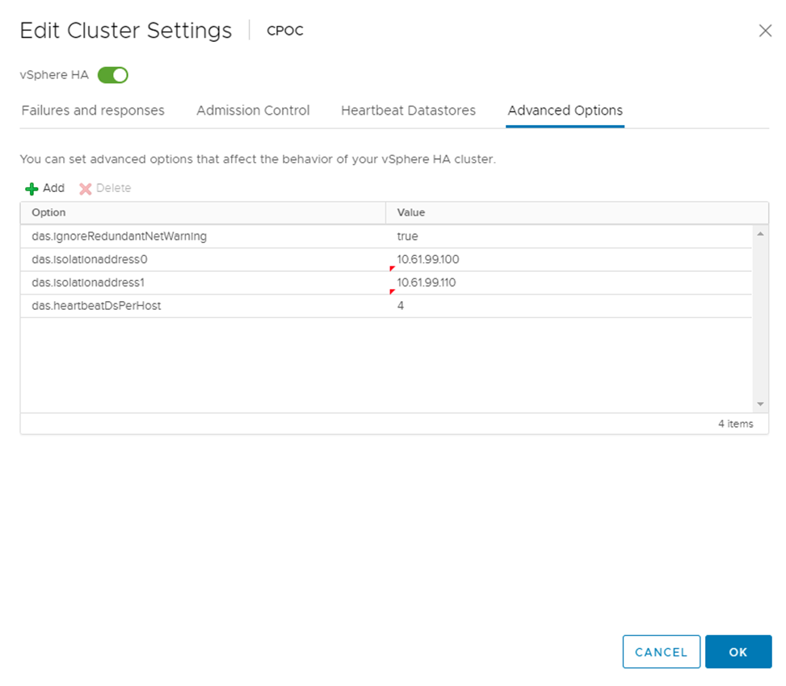

= Directrices de implementación y diseño de VMSC
:hardbreaks:
:allow-uri-read: 
:nofooter: 
:icons: font
:linkattrs: 
:imagesdir: ../media/

[role="lead"]
Este documento describe las guías de diseño e implementación para VMSC con sistemas de almacenamiento ONTAP.

== Configuración de almacenamiento de NetApp

Las instrucciones de configuración para NetApp MetroCluster (en lo que se refiere como configuración de MCC) están disponibles en https://docs.netapp.com/us-en/ontap-metrocluster/["Documentación de MetroCluster"]. También puede encontrar instrucciones para SnapMirror Active Sync en https://docs.netapp.com/us-en/ontap/smbc/index.html["Información general sobre la continuidad del negocio de SnapMirror"].

Después de configurar MetroCluster, administrarlo es como administrar un entorno ONTAP tradicional. Puede configurar máquinas virtuales de almacenamiento (SVM) con diferentes herramientas, como la interfaz de línea de comandos (CLI), System Manager o Ansible. Una vez que se han configurado las SVM, cree interfaces lógicas (LIF), volúmenes y números de unidad lógica (LUN) en el clúster que se utilizarán para operaciones normales. Estos objetos se replicarán automáticamente en el otro clúster mediante la red de conexión de clústeres.

Si no utiliza MetroCluster, puede usar la sincronización activa de SnapMirror, que proporciona protección granular de almacenes de datos y acceso activo-activo en múltiples clústeres de ONTAP en diferentes dominios de fallo. SnapMirror Active Sync utiliza grupos de coherencia para garantizar la coherencia en orden de escritura entre uno o varios almacenes de datos y puede crear varios grupos de coherencia en función de los requisitos de la aplicación y del almacén de datos. Los grupos de coherencia son especialmente útiles para aplicaciones que requieren sincronización de datos entre varios almacenes de datos. La sincronización activa de SnapMirror también admite asignaciones de dispositivos sin formato (RDM) y almacenamiento conectado mediante invitado con iniciadores iSCSI invitados. Puede obtener más información sobre grupos de consistencia en https://docs.netapp.com/us-en/ontap/consistency-groups/index.html["Información general sobre los grupos de consistencia"].

Hay alguna diferencia en la gestión de una configuración VMSC con sincronización activa de SnapMirror en comparación con una MetroCluster. En primer lugar, se trata de una configuración solo SAN, no se puede proteger ningún almacén de datos NFS con sincronización activa de SnapMirror. Segundo, debe asignar ambas copias de las LUN a los hosts ESXi para que accedan a los almacenes de datos replicados en ambos dominios de fallo.

== VMware vSphere ha

=== Cree un clúster de vSphere HA

La creación de un clúster de vSphere HA es un proceso de varios pasos que se documenta completamente en https://docs.vmware.com/en/VMware-vSphere/8.0/vsphere-vcenter-esxi-management/GUID-F7818000-26E3-4E2A-93D2-FCDCE7114508.html["Cómo se crean y configuran clústeres en vSphere Client en docs.vmware.com"]. En resumen, primero debe crear un clúster vacío y, después, utilizando vCenter, debe añadir hosts y especificar la alta disponibilidad de vSphere y otros ajustes del clúster.

*Nota:* Nada en este documento reemplaza https://core.vmware.com/resource/vmware-vsphere-metro-storage-cluster-recommended-practices["Prácticas recomendadas para VMware vSphere Metro Storage Cluster"]

Para configurar un clúster de alta disponibilidad, realice los siguientes pasos:

. Conéctese a la interfaz de usuario de vCenter.
. En Hosts and Clusters, vaya al centro de datos donde desea crear su clúster de alta disponibilidad.
. Haga clic con el botón derecho en el objeto del centro de datos y seleccione New Cluster. En los conceptos básicos, asegúrese de haber habilitado vSphere DRS y vSphere HA. Complete el asistente.

image::../media/vmsc_3_1.png[Nuevo clúster,624,302]

. Seleccione el clúster y vaya a la pestaña Configure. Seleccione vSphere HA y haga clic en Edit.
. En Supervisión de host, seleccione la opción Habilitar supervisión de host.

image::../media/vmsc_3_2.png[Activar la opción Supervisión de host,624,475]

. Mientras todavía está en la pestaña Fallos y Respuestas, en VM Monitoring, seleccione la opción VM Monitoring Only o VM and Application Monitoring.

image::../media/vmsc_3_3.png[Supervisión de máquinas virtuales,624,480]

. En Control de admisión, establezca la opción de control de admisión de HA en Reserva de recursos de cluster; utilice 50% CPU/MEM.

image::../media/vmsc_3_4.png[Control de admisión,624,479]

. Se hace clic en «OK».
. Seleccione DRS y haga clic en EDIT.
. Establezca el nivel de automatización en manual a menos que las aplicaciones lo requieran.

image::../media/vmsc_3_5.png[vmsc 3 5,624,336]

. Habilite VM Component Protection, consulte https://docs.vmware.com/en/VMware-vSphere/8.0/vsphere-availability/GUID-F01F7EB8-FF9D-45E2-A093-5F56A788D027.html["docs.vmware.com"].
. Se recomiendan las siguientes configuraciones adicionales de alta disponibilidad de vSphere para VMSC con MCC:

[cols="50%,50%"]
|===
| Fallo | Respuesta 

| Error del host | Reiniciar las máquinas virtuales 

| Aislamiento de hosts | Deshabilitado 

| Almacén de datos con pérdida permanente de dispositivo (PDL) | Apagar y reiniciar los equipos virtuales 

| Almacén de datos con todas las rutas inactivas (APD) | Apagar y reiniciar los equipos virtuales 

| El huésped no es molesto | Restablecer las máquinas virtuales 

| Política de reinicio de máquinas virtuales | Determinado por la importancia del equipo virtual 

| Respuesta para el aislamiento del host | Apagar y reiniciar equipos virtuales 

| Respuesta para datastore con PDL | Apagar y reiniciar los equipos virtuales 

| Respuesta del almacén de datos con APD | Apagar y reiniciar equipos virtuales (conservador) 

| Demora en recuperación tras fallos de equipos virtuales para APD | 3 minutos 

| Respuesta para la recuperación de APD con tiempo de espera APD | Deshabilitado 

| Supervisión de la sensibilidad de los equipos virtuales | Preajuste ALTO 
|===

=== Configurar almacenes de datos para Heartbeat

La alta disponibilidad de vSphere utiliza almacenes de datos para supervisar hosts y máquinas virtuales cuando se produce un error en la red de gestión. Es posible configurar la forma en la que vCenter selecciona los almacenes de datos de latido. Para configurar los almacenes de datos para latir, lleve a cabo los siguientes pasos:

. En la sección Datastore Heartbeat, seleccione Use datastores from the Specified List y complemente automáticamente si es necesario.
. Seleccione los almacenes de datos que desee utilizar vCenter en ambos sitios y pulse OK.

image::../media/vmsc_3_6.png[Una captura de pantalla de una descripción de computadora generada automáticamente,624,540]

=== Configurar opciones avanzadas

* Detección de fallos del host *

Los eventos de aislamiento se producen cuando los hosts dentro de un clúster de alta disponibilidad pierden la conectividad a la red u otros hosts del clúster. De forma predeterminada, vSphere HA utilizará la puerta de enlace predeterminada para su red de gestión como dirección de aislamiento predeterminada. Sin embargo, puede especificar direcciones de aislamiento adicionales para que el host haga ping para determinar si se debe activar una respuesta de aislamiento. Agregue dos IP de aislamiento que puedan hacer ping, una por sitio. No utilice la IP de la puerta de enlace. La configuración avanzada de HA de vSphere utilizada es das.isolationaddress. Puede utilizar las direcciones IP de ONTAP o Mediator para este fin.

Consulte https://core.vmware.com/resource/vmware-vsphere-metro-storage-cluster-recommended-practices#sec2-sub5["core.vmware.com"] para obtener más información__.__

Agregar una configuración avanzada llamada das.heartbeatDsPerHost puede aumentar el número de almacenes de datos de latido. Utilice cuatro almacenes de datos para el corazón (HB DSS): Dos por sitio. Utilice la opción “Seleccionar de la lista pero cumplido”. Esto es necesario porque si un sitio falla, usted todavía necesita dos HB DSS. Sin embargo, esas empresas no tienen que estar protegidas con sincronización activa de SnapMirror o MCC.

Consulte https://core.vmware.com/resource/vmware-vsphere-metro-storage-cluster-recommended-practices#sec2-sub5["core.vmware.com"] para obtener más información__.__

Afinidad de VMware DRS para NetApp MetroCluster

En esta sección creamos grupos DRS para equipos virtuales y hosts para cada sitio\clúster del entorno MetroCluster. A continuación, configuramos las reglas de VM\Host para alinear la afinidad de host de VM con los recursos de almacenamiento local. Por ejemplo, las máquinas virtuales de la dirección A pertenecen al grupo de máquinas virtuales sitea_vms y la ubicación A pertenecen al grupo de hosts sitea_hosts. A continuación, en VM\Host Rules, indicamos que sitea_vms debe ejecutarse en hosts en sitea_Hosts.

=== _Best Practice_

* NetApp recomienda encarecidamente la especificación *Debe ejecutarse en hosts del grupo* en lugar de la especificación *Debe ejecutarse en hosts del grupo*. En caso de que se produzca un fallo del host del sitio A, es necesario reiniciar las máquinas virtuales del sitio A en los hosts del sitio B a través de vSphere HA, pero la última especificación no permite a HA reiniciar los equipos virtuales en el sitio B, ya que es una regla estricta. La especificación anterior es una regla flexible y se infringirá en caso de alta disponibilidad, lo que permitirá la disponibilidad en lugar de rendimiento.

*Nota:* Puede crear una alarma basada en eventos que se activa cuando una máquina virtual viola una regla de afinidad VM-Host. En vSphere Client, agregue una nueva alarma para la máquina virtual y seleccione “VM is Violating VM-Host Affinity Rule” como disparador de eventos. Para obtener más información sobre la creación y edición de alarmas, consulte http://pubs.vmware.com/vsphere-51/topic/com.vmware.ICbase/PDF/vsphere-esxi-vcenter-server-51-monitoring-performance-guide.pdf["Supervisión y rendimiento de vSphere"] documentación.

=== Crear grupos de hosts DRS

Para crear grupos de hosts DRS específicos del sitio A y del sitio B, realice los siguientes pasos:

. En vSphere Web Client, haga clic con el botón derecho en el clúster en el inventario y seleccione Settings.
. Haga clic en VM\Host Groups.
. Haga clic en Añadir.
. Escriba el nombre del grupo (por ejemplo, sitea_hosts).
. En el menú Tipo, seleccione Grupo de hosts.
. Haga clic en Agregar y seleccione los hosts deseados del sitio A y haga clic en Aceptar.
. Repita estos pasos para agregar otro grupo de hosts para el sitio B.
. Haga clic en Aceptar.

=== Crear grupos de máquinas virtuales DRS

Para crear grupos de máquinas virtuales DRS específicos del sitio A y del sitio B, realice los siguientes pasos:

. En vSphere Web Client, haga clic con el botón derecho en el clúster en el inventario y seleccione Settings.

. Haga clic en VM\Host Groups.
. Haga clic en Añadir.
. Escriba el nombre del grupo (por ejemplo, sitea_vms).
. En el menú Type, seleccione VM Group.
. Haga clic en Add y seleccione las máquinas virtuales deseadas en el sitio A y, a continuación, haga clic en OK.
. Repita estos pasos para agregar otro grupo de hosts para el sitio B.
. Haga clic en Aceptar.

=== Crear reglas de host de VM

Para crear reglas de afinidad de DRS específicas para el sitio A y el sitio B, realice los siguientes pasos:

. En vSphere Web Client, haga clic con el botón derecho en el clúster en el inventario y seleccione Settings.

. Haga clic en VM\Host Rules.
. Haga clic en Añadir.
. Escriba el nombre de la regla (por ejemplo, sitea_affinity).
. Compruebe que la opción Activar regla está activada.
. En el menú Type, seleccione Virtual Machines to Hosts.
. Seleccione el grupo de VM (por ejemplo, sitea_vms).
. Seleccione el grupo Host (por ejemplo, sitea_Hosts).
. Repita estos pasos para añadir otra regla VM\Host para el sitio B.
. Haga clic en Aceptar.

image::../media/vmsc_3_8.png[Una captura de pantalla de una descripción de computadora generada automáticamente,474,364]

== DRS de almacenamiento de VMware vSphere para NetApp MetroCluster

=== Crear clústeres de almacenes de datos

Para configurar un clúster de almacén de datos para cada sitio, complete los siguientes pasos:

. Use el cliente web de vSphere, vaya al centro de datos donde reside el clúster de alta disponibilidad en Storage.
. Haga clic con el botón derecho en el objeto del centro de datos y seleccione Storage > New Datastore Cluster.
. Seleccione la opción ON Storage DRS y haga clic en Next.
. Establezca todas las opciones en Sin automatización (Modo manual) y haga clic en Siguiente.

==== _Best Practice_

* NetApp recomienda configurar el DRS de almacenamiento en modo manual, de modo que el administrador decida y controle cuándo es necesario realizar las migraciones.

image::../media/vmsc_3_9.png[DRS de almacenamiento,528,94]

. Compruebe que la casilla de verificación Activar Métrica de E/S para Recomendaciones de SDRS está activada; los valores de métrica se pueden dejar con los valores predeterminados.

image::../media/vmsc_3_10.png[Recomendaciones de SDRS,624,241]

. Seleccione el clúster de alta disponibilidad y haga clic en Next.

image::../media/vmsc_3_11.png[Clúster de ALTA disponibilidad,624,149]

. Seleccione los almacenes de datos que pertenecen al sitio A y haga clic en Next.

image::../media/vmsc_3_12.png[almacenes de datos,624,134]

. Revise las opciones y haga clic en Finish.
. Repita estos pasos para crear el clúster de almacenes de datos del sitio B y verifique que solo estén seleccionados los almacenes de datos del sitio B.

=== Disponibilidad del vCenter Server

Los dispositivos vCenter Server Appliances (VCSA) deben estar protegidos con alta disponibilidad de vCenter. La alta disponibilidad de vCenter le permite implementar dos VCSA en un par de alta disponibilidad activo-pasivo. Uno en cada dominio de fallo. Puede obtener más información sobre la alta disponibilidad de vCenter en https://docs.vmware.com/en/VMware-vSphere/8.0/vsphere-availability/GUID-4A626993-A829-495C-9659-F64BA8B560BD.html["docs.vmware.com"].
