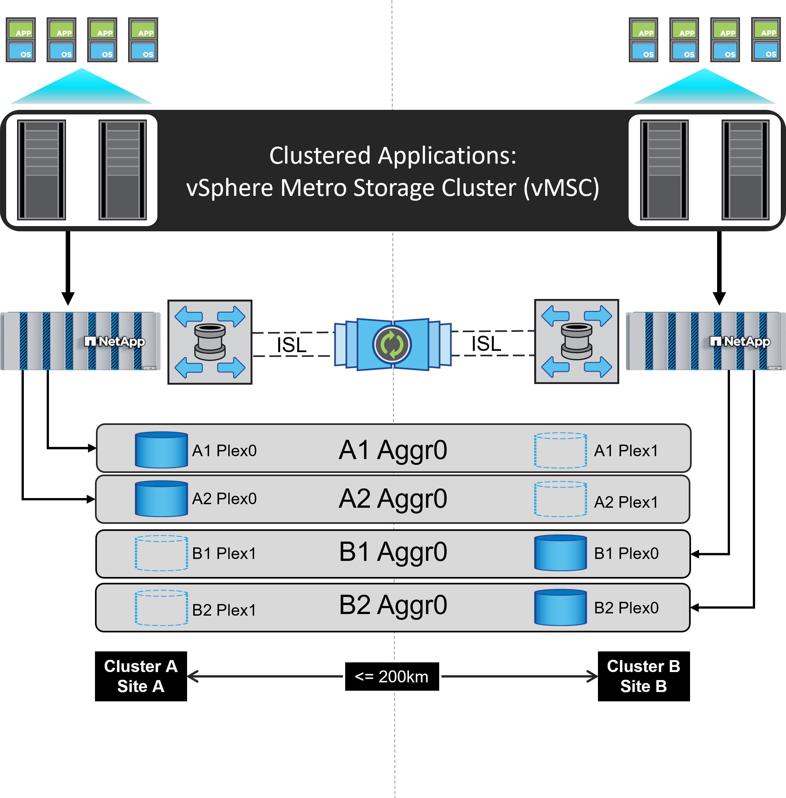
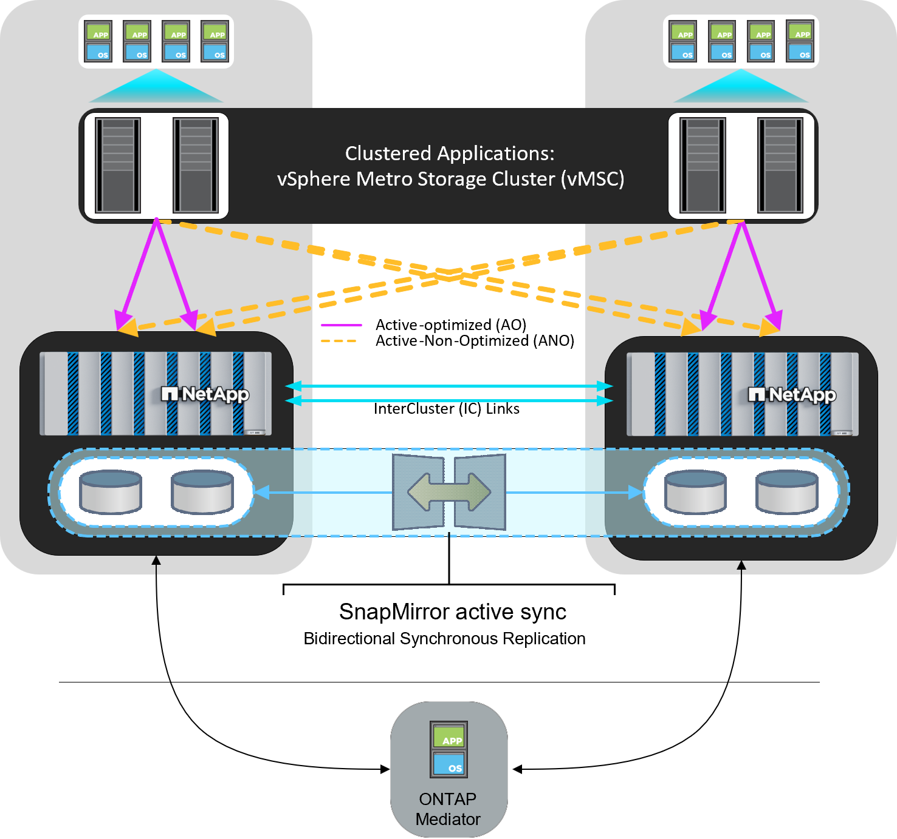

= Clúster de almacenamiento vSphere Metro con ONTAP
:hardbreaks:
:allow-uri-read: 
:nofooter: 
:icons: font
:linkattrs: 
:imagesdir: ../media/

[role="lead"]
El hipervisor vSphere líder del sector de VMware se puede poner en marcha como un clúster ampliado conocido como vSphere Metro Storage Cluster (VMSC).

Las soluciones VMSC son compatibles con NetApp® MetroCluster™ y SnapMirror Active Sync (anteriormente conocido como continuidad empresarial de SnapMirror o SMBC) y proporcionan continuidad empresarial avanzada si uno o más dominios de fallo sufren una interrupción total. La resistencia a los diferentes modos de fallo depende de las opciones de configuración que elija.

NOTE: Esta documentación sustituye a los informes técnicos publicados anteriormente _TR-4128: VSphere en NetApp MetroCluster_

== Soluciones de disponibilidad continua para entornos vSphere

La arquitectura ONTAP es una plataforma de almacenamiento flexible y escalable que proporciona servicios SAN (FCP, iSCSI y NVMe-oF) y NAS (NFS v3 y v4,1) para almacenes de datos. Los sistemas de almacenamiento NetApp AFF, ASA y FAS utilizan el sistema operativo ONTAP para ofrecer protocolos adicionales para acceso al almacenamiento invitado, como S3 y SMB/CIFS.

NetApp MetroCluster utiliza la función de alta disponibilidad (conmutación por error de controladora o director financiero) de NetApp para proteger frente a fallos de controladora. También incluye tecnología SyncMirror local, recuperación tras fallos en clúster en caso de desastre (conmutación por error en cluster en caso de desastre o CFOD), redundancia de hardware y separación geográfica para alcanzar altos niveles de disponibilidad. SyncMirror refleja de forma síncrona los datos en las dos mitades de la configuración de MetroCluster mediante la escritura de los datos en dos plexes: El plex local (en la bandeja local) que sirve los datos de forma activa y el plex remoto (en la bandeja remota) normalmente no ofrece datos. La redundancia de hardware se pone en marcha para todos los componentes de MetroCluster, como las controladoras, el almacenamiento, los cables, los switches (utilizados con Fabric MetroCluster) y los adaptadores.

La sincronización activa de NetApp SnapMirror, disponible en sistemas que no sean MetroCluster y en sistemas ASA R2, ofrece protección granular en almacenes de datos con protocolos FCP e iSCSI SAN. Le permite proteger todo el VMSC o proteger de forma selectiva las cargas de trabajo de alta prioridad. Ofrece acceso activo-activo tanto a sitios locales como remotos, a diferencia de NetApp MetroCluster, que es una solución activa-en espera. A partir de ONTAP 9.15.1, la sincronización activa de SnapMirror admite una funcionalidad activo-activo simétrica, lo que permite operaciones de I/O de lectura y escritura desde ambas copias de una LUN protegida con replicación síncrona bidireccional, lo que permite que ambas copias LUN sirvan operaciones de I/O localmente. Antes de ONTAP 9.15.1, la sincronización activa de SnapMirror solo admite configuraciones activo-activo asimétricas, en las que los datos del sitio secundario están proxy a la copia principal de una LUN.

Para crear un clúster HA/DRS de VMware en dos sitios, los hosts ESXi se usan y gestionan mediante una instancia de vCenter Server Appliance (VCSA). Las redes de gestión de vSphere, vMotion® y máquinas virtuales están conectadas a través de una red redundante entre los dos sitios. El servidor vCenter que gestiona el clúster HA/DRS puede conectarse a los hosts ESXi en ambos sitios y se debe configurar mediante vCenter HA.

Consulte https://docs.vmware.com/en/VMware-vSphere/8.0/vsphere-vcenter-esxi-management/GUID-F7818000-26E3-4E2A-93D2-FCDCE7114508.html["¿Cómo se crean y configuran clústeres en vSphere Client"] Para configurar una alta disponibilidad de vCenter.

También debe consultar https://www.vmware.com/docs/vmw-vmware-vsphere-metro-storage-cluster-recommended-practices["Prácticas recomendadas para VMware vSphere Metro Storage Cluster"] .

== ¿Qué es vSphere Metro Storage Cluster?

VSphere Metro Storage Cluster (VMSC) es una configuración certificada que protege las máquinas virtuales (VM) y los contenedores frente a fallos. Esto se logra mediante el uso de conceptos de almacenamiento extendidos junto con clústeres de hosts ESXi, que se distribuyen en diferentes dominios de fallo, como bastidores, edificios, campus o incluso ciudades. Las tecnologías de almacenamiento de sincronización activa de NetApp MetroCluster y SnapMirror se usan para proporcionar una protección de un objetivo de punto de recuperación cero (RPO=0) en los clústeres de hosts. La configuración de VMSC está diseñada para garantizar que los datos están siempre disponibles incluso si falla todo un «sitio» físico o lógico. Un dispositivo de almacenamiento que forme parte de la configuración de VMSC debe estar certificado tras someterse a un proceso de certificación VMSC exitoso. Todos los dispositivos de almacenamiento admitidos se pueden encontrar en el https://www.vmware.com/resources/compatibility/search.php["Guía de compatibilidad de almacenamiento de VMware"].

Si desea obtener más información sobre las directrices de diseño para vSphere Metro Storage Cluster, consulte la siguiente documentación:

* https://kb.vmware.com/s/article/2031038["Compatibilidad de VMware vSphere con NetApp MetroCluster"]
* https://kb.vmware.com/s/article/83370["Compatibilidad de VMware vSphere con Continuidad del negocio de SnapMirror de NetApp"] (Ahora conocido como SnapMirror active sync)

NetApp MetroCluster se puede poner en marcha en dos configuraciones diferentes para usarlas con vSphere:

* Stretch MetroCluster
* Fabric MetroCluster

A continuación se muestra un diagrama topológico de alto nivel de MetroCluster de ampliación.

Consulte https://www.netapp.com/support-and-training/documentation/metrocluster/["Documentación de MetroCluster"] Para obtener información específica sobre diseño e implementación para MetroCluster.

SnapMirror Active Sync también se puede poner en marcha de dos formas distintas.

* Asimétrico
* Sincronización activa simétrica (ONTAP 9.15.1)

Consulte https://docs.netapp.com/us-en/ontap/smbc/index.html["Documentos de NetApp"] para obtener información específica sobre el diseño y la puesta en marcha de la sincronización activa de SnapMirror.
