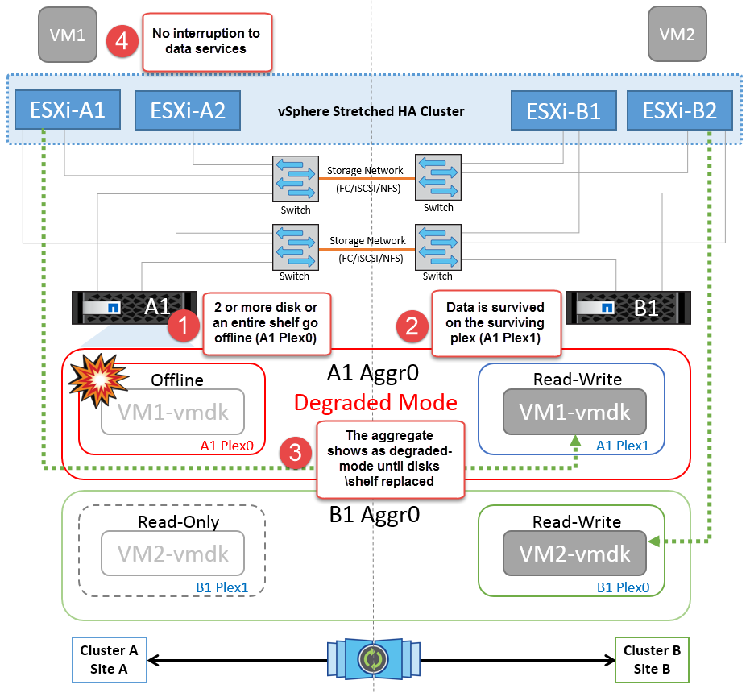

= Situaciones de fallo para VMSC con MetroCluster
:hardbreaks:
:allow-uri-read: 
:nofooter: 
:icons: font
:linkattrs: 
:imagesdir: ../media/

[role="lead"]
En las siguientes secciones se resumen los resultados esperados de varios escenarios de fallo con sistemas VMSC y NetApp MetroCluster.

== Fallo de ruta de almacenamiento única

En esta situación, si se produce un error en componentes como el puerto HBA, el puerto de red, el puerto del switch de datos de interfaz de usuario o un cable FC o Ethernet, esa ruta particular al dispositivo de almacenamiento se marca como muerta por el host ESXi. Si se configuran varias rutas para el dispositivo de almacenamiento proporcionando resiliencia en el puerto de HBA/red/switch, ESXi idealmente ejecuta una conmutación de rutas. Durante este periodo, las máquinas virtuales permanecen en ejecución sin que se vean afectadas, porque se cuida de la disponibilidad del almacenamiento mediante varias rutas al dispositivo de almacenamiento.

NOTE: No hay ningún cambio en el comportamiento de MetroCluster en este escenario, y todos los almacenes de datos siguen estando intactos en sus sitios respectivos.

=== _Best Practice_

En entornos en los que se utilizan volúmenes NFS/iSCSI, NetApp recomienda tener al menos dos vínculos superiores de red configurados para el puerto NFS vmkernel en el vSwitch estándar y lo mismo en el grupo de puertos en el que se asigna la interfaz de NFS vmkernel para el vSwitch distribuido. La agrupación de NIC se puede configurar en activo-activo o activo-en espera.

Además, para las LUN iSCSI, la multivía debe configurarse vinculando las interfaces de vmkernel con los adaptadores de red iSCSI. Si quiere más información, consulte la documentación de almacenamiento de vSphere.

=== _Best Practice_

En entornos en los que se usan LUN de Fibre Channel, NetApp recomienda tener al menos dos HBA, lo que garantiza la resistencia a nivel de HBA/puerto. NetApp también recomienda la división en zonas de un solo iniciador a un único destino como práctica recomendada para configurar la división en zonas.

Debe utilizarse Virtual Storage Console (VSC) para establecer normativas de accesos múltiples, porque establece normativas para todos los dispositivos de almacenamiento de NetApp nuevos y existentes.

== Fallo de un host ESXi único

image::../media/vmsc_5_1.png[Un fallo de host único.,624,598]

En esta situación, si hay un fallo de host ESXi, el nodo maestro del clúster de alta disponibilidad de VMware detecta el fallo del host porque ya no recibe los latidos de red. Para determinar si el host está realmente inactivo o sólo una partición de red, el nodo maestro supervisa los latidos del almacén de datos y, si están ausentes, realiza una comprobación final haciendo ping en las direcciones IP de gestión del host fallido. Si todas estas comprobaciones son negativas, el nodo maestro declara a este host un host fallido y todas las máquinas virtuales que se estaban ejecutando en este host fallido se reinician en el host superviviente del cluster.

Si se han configurado las reglas de afinidad de host y VM de DRS (las VM del grupo de VM sitea_vms deben ejecutar hosts en el grupo de hosts sitea_Hosts), el maestro de HA primero comprueba los recursos disponibles en el sitio A. Si no hay hosts disponibles en el sitio A, el maestro intenta reiniciar las máquinas virtuales en los hosts del sitio B.

Es posible que las máquinas virtuales se inicien en los hosts ESXi en el otro sitio si hay una restricción de recursos en el sitio local. Sin embargo, las reglas de afinidad de host y máquina virtual de DRS definidas corregirán si se viola alguna regla migrando las máquinas virtuales de nuevo a cualquier host ESXi sobreviviente en el sitio local. En los casos en que DRS se defina en manual, NetApp recomienda invocar DRS y aplicar las recomendaciones para corregir la ubicación de la máquina virtual.

No hay ningún cambio en el comportamiento de MetroCluster en este escenario y todos los almacenes de datos siguen estando intactos en sus sitios respectivos.

== Aislamiento de hosts ESXi

image::../media/vmsc_5_2.png[Aislamiento de hosts ESXi,624,301]

En esta situación, si la red de gestión del host ESXi está inactiva, el nodo principal del clúster de alta disponibilidad no recibirá ningún latido y, por lo tanto, este host se aísla en la red. Para determinar si ha fallado o solo está aislado, el nodo maestro comienza a supervisar el latido del almacén de datos. Si está presente, el nodo maestro declara que el host está aislado. Dependiendo de la respuesta de aislamiento configurada, el host puede optar por apagarse, apagar las máquinas virtuales o incluso dejar encendidas las máquinas virtuales. El intervalo predeterminado para la respuesta de aislamiento es de 30 segundos.

No hay ningún cambio en el comportamiento de MetroCluster en este escenario y todos los almacenes de datos siguen estando intactos en sus sitios respectivos.

== Fallo de la bandeja de discos

En esta situación, se produce un fallo de más de dos discos o una bandeja entera. Los datos se sirven desde el plex superviviente sin interrupción de los servicios de datos. El fallo del disco puede afectar a un plex local o remoto. Los agregados se mostrarán como degradado porque solo está activo un plex. Una vez sustituidos los discos que han fallado, los agregados afectados se sincronizarán automáticamente para volver a compilar los datos. Tras realizar la resincronización, los agregados volverán automáticamente al modo reflejado normal. Si falla más de dos discos dentro de un mismo grupo RAID, es necesario reconstruir el plex.

*[NOTA]

* Durante este periodo, no se ven afectadas las operaciones de I/O de las máquinas virtuales, pero el rendimiento está degradado porque se accede a los datos desde la bandeja de discos remota a través de enlaces ISL.

== Fallo de una controladora de almacenamiento única

En este escenario, una de las dos controladoras de almacenamiento falla en un sitio. Dado que hay un par de alta disponibilidad en cada sitio, el fallo de un nodo de forma transparente activa automáticamente la conmutación al otro nodo. Por ejemplo, si falla el nodo A1, su almacenamiento y sus cargas de trabajo se transfieren automáticamente al nodo A2. Las máquinas virtuales no se verán afectadas porque todos los plexes permanecen disponibles. Los nodos del segundo sitio (B1 y B2) no se ven afectados. Además, vSphere HA no realizará ninguna acción porque el nodo principal del clúster seguirá recibiendo los latidos de red.

image::../media/vmsc_5_4.png[Fallo de un nodo único,624,603]

Si la conmutación al respaldo forma parte de un desastre gradual (el nodo A1 conmuta al nodo A2) y hay un fallo posterior de A2 o el fallo completo del sitio A, el cambio tras un desastre puede ocurrir en el sitio B.

== Fallos de enlace de interinterruptor

=== Fallo de enlace de interswitch en la red de gestión

image::../media/vmsc_5_5.png[Fallo de enlace entre switches en la red de gestión,624,184]

En este escenario, si los enlaces ISL en la red de gestión de host de interfaz de usuario producen un error, los hosts ESXi del sitio A no podrán comunicarse con los hosts ESXi del sitio B. Esto dará lugar a una partición de red porque los hosts ESXi de un sitio concreto no podrán enviar los latidos de red al nodo maestro del clúster HA. Como tal, habrá dos segmentos de red debido a la partición y habrá un nodo maestro en cada segmento que protegerá las VM de fallos de host dentro del sitio en particular.

NOTE: Durante este período, las máquinas virtuales permanecen en ejecución y no hay cambios en el comportamiento de MetroCluster en este escenario. Todos los almacenes de datos siguen estando intactos en sus respectivos sitios.

=== Fallo de enlace interswitch en la red de almacenamiento

image::../media/vmsc_5_6.png[Fallo de enlace interswitch en la red de almacenamiento,624,481]

En este escenario, si los enlaces ISL en la red de almacenamiento de back-end fallan, los hosts del sitio A perderán acceso a los volúmenes de almacenamiento o las LUN del clúster B en el sitio B y viceversa. Las reglas de VMware DRS se definen de modo que la afinidad de sitios de almacenamiento host facilita que los equipos virtuales funcionen sin que el sitio se vea afectado.

Durante este período, las máquinas virtuales permanecen en ejecución en sus respectivos sitios y no hay cambios en el comportamiento de MetroCluster en este escenario. Todos los almacenes de datos siguen estando intactos en sus respectivos sitios.

Si por algún motivo se violó la regla de afinidad (por ejemplo, VM1, que se suponía que se ejecutaba desde la ubicación A donde sus discos residen en nodos del clúster local A, se está ejecutando en un host del sitio B), se accederá al disco de la máquina virtual de forma remota a través de enlaces ISL. Debido a un fallo de enlace ISL, VM1 ejecutándose en la instalación B no podría escribir en sus discos porque las rutas al volumen de almacenamiento están inactivas y la máquina virtual determinada está inactiva. En estos casos, VMware HA no realiza ninguna acción puesto que los hosts envían latidos de forma activa. Esas máquinas virtuales deben apagarse y encenderse manualmente en sus respectivos sitios. La siguiente figura ilustra una VM que viola una regla de afinidad DRS.

image::../media/vmsc_5_7.png[Una máquina virtual que infringe una regla de afinidad de DRS no puede escribir en los discos después de un fallo de ISL,624,502]

=== Todos los fallos de interswitch o la partición completa del centro de datos

En este escenario, todos los enlaces ISL entre los sitios están inactivos y los dos sitios están aislados uno de otro. Como se explicó en escenarios anteriores, como el fallo ISL en la red de gestión y en la red de almacenamiento, las máquinas virtuales no se ven afectadas por un fallo de ISL completo.

Una vez que los hosts ESXi hayan particionado entre sitios, el agente de alta disponibilidad de vSphere comprobará si hay latidos del almacén de datos y, en cada sitio, los hosts ESXi locales podrán actualizar los latidos del almacén de datos a sus respectivos volúmenes/LUN de lectura/escritura. Los hosts del sitio A asumirán que los otros hosts ESXi del sitio B han fallado porque no hay ningún latido de red/almacén de datos. VSphere HA en el sitio A intentará reiniciar las máquinas virtuales del sitio B, lo cual eventualmente fallará porque no se podrá acceder a los almacenes de datos del sitio B debido a un fallo del ISL del almacenamiento. Una situación similar se repite en el sitio B.

image::../media/vmsc_5_8.png[Todos los fallos de ISL o la partición completa del centro de datos,624,596]

NetApp recomienda determinar si alguna máquina virtual ha infringido las reglas de DRS. Los equipos virtuales que se ejecuten desde un sitio remoto estarán inactivos ya que no podrán acceder al almacén de datos y vSphere HA reiniciará esa máquina virtual en el sitio local. Una vez que los enlaces ISL vuelvan a estar en línea, la máquina virtual que se estaba ejecutando en el sitio remoto se desactivará, ya que no puede haber dos instancias de máquinas virtuales ejecutándose con las mismas direcciones MAC.

image::../media/vmsc_5_9.png[Una partición del centro de datos donde VM1 violó una regla de afinidad DRS,624,614]

=== Fallo de interswitch Link en ambas estructuras en NetApp MetroCluster

En un escenario en el que uno o varios ISL fallan, el tráfico continúa por los enlaces restantes. Si todos los ISL de ambas estructuras fallan, de modo que no hay ningún enlace entre los sitios para el almacenamiento y la replicación de NVRAM, cada controladora seguirá proporcionando sus datos locales. Cuando se restaura al menos un ISL, la resincronización de todos los complejos se realiza de forma automática.

Las escrituras que se produzcan después de que todos los ISL estén inactivos no se reflejarán en el otro sitio. Una conmutación de sitios en caso de desastre, mientras la configuración se encuentra en este estado, por lo tanto, incurriría en la pérdida de los datos que no se habían sincronizado. En este caso, se requiere intervención manual para la recuperación después del cambio. Si es probable que no haya ISL disponibles durante un largo período de tiempo, un administrador puede optar por cerrar todos los servicios de datos para evitar el riesgo de pérdida de datos si es necesario una conmutación por desastre. La realización de esta acción debe evaluarse para la probabilidad de que se produzca un desastre que requiera la conmutación del servicio antes de que esté disponible al menos un ISL. Como alternativa, si los ISL fallan en un escenario en cascada, un administrador podría activar una conmutación de sitios planificada a uno de los sitios antes de que todos los enlaces hayan fallado.

image::../media/vmsc_5_10.png[Fallo de enlace interswitch en ambas estructuras en NetApp MetroCluster.,624,597]

=== Fallo de enlace de clúster con conexión entre iguales

En un supuesto de fallo de enlace de clústeres con conexión entre iguales, dado que los ISL de estructura aún están activos, los servicios de datos (lecturas y escrituras) continúan en ambos sitios en ambos complejos. No se puede propagar ningún cambio de configuración del clúster (por ejemplo, añadir una nueva SVM o aprovisionar un volumen o un LUN en una SVM existente) al otro sitio. Estos se mantienen en los volúmenes de metadatos de CRS locales y se propagan automáticamente al otro cluster tras la recuperación del enlace de cluster entre iguales. Si se necesita una conmutación por error forzada antes de poder restaurar el enlace de clúster entre iguales, se volverán a reproducir automáticamente los cambios pendientes de configuración de clúster desde la copia replicada remota de los volúmenes de metadatos del sitio superviviente como parte del proceso de conmutación por error.

image::../media/vmsc_5_11.png[Error de enlace de clústeres con conexión entre iguales,624,303]

=== Fallo completo del sitio

En un supuesto de fallo del sitio A completo, los hosts ESXi del sitio B no obtendrán el latido de red de los hosts ESXi del sitio A porque están inactivos. El maestro de alta disponibilidad en el sitio B verificará que los latidos del almacén de datos no están presentes, declarará que los hosts del sitio A han fallado e intentará reiniciar el sitio A de los equipos virtuales en el sitio B. Durante este periodo, el administrador de almacenamiento realiza una conmutación de sitios para reanudar los servicios de los nodos fallidos en el sitio superviviente. Esto restaura todos los servicios de almacenamiento del sitio A en el sitio B. Después de que el sitio haya volúmenes o LUN disponibles en el sitio B, el agente maestro de alta disponibilidad intentará reiniciar el sitio A, máquinas virtuales del sitio B.

Si el intento del agente maestro HA de vSphere de reiniciar una máquina virtual (lo que implica registrarla y encenderla) falla, el reinicio se vuelve a intentar después de un retraso. El retardo entre reinicios se puede configurar hasta un máximo de 30 minutos. VSphere HA intenta estos reinicios durante un número máximo de intentos (seis intentos de forma predeterminada).

NOTE: El maestro de alta disponibilidad no inicia los intentos de reinicio hasta que el administrador de ubicación encuentra el almacenamiento adecuado, por lo que en caso de un fallo completo del sitio, sería después de que se haya realizado el cambio.

Si el sitio A se ha cambiado, un fallo posterior de uno de los nodos del sitio B superviviente se puede gestionar sin problemas mediante la conmutación al nodo superviviente. En este caso, solo un nodo realiza el trabajo de cuatro nodos. En este caso, la recuperación consistiría en realizar un retorno al nodo local. A continuación, cuando se restaura el sitio A, se realiza una operación de conmutación para restaurar el funcionamiento en estado constante de la configuración.

image::../media/vmsc_5_12.png[Fallo de sitio completo,624,593]
