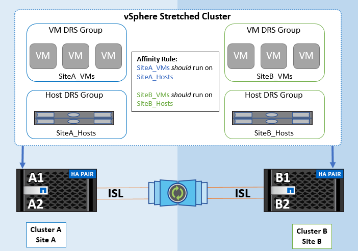

= Descripción general de la solución de VMware vSphere
:hardbreaks:
:allow-uri-read: 
:nofooter: 
:icons: font
:linkattrs: 
:imagesdir: ../media/

[role="lead"]
VCenter Server Appliance (VCSA) es el potente sistema de gestión centralizada y un panel único para vSphere que permiten a los administradores operar clústeres ESXi de forma eficiente. Facilita funciones clave como el aprovisionamiento de máquinas virtuales, la operación vMotion, alta disponibilidad, planificador de recursos distribuidos (DRS), Tanzu Kubernetes Grid, etc. Es un componente esencial en los entornos cloud de VMware y debe diseñarse teniendo en cuenta la disponibilidad del servicio.

== Alta disponibilidad de vSphere

La tecnología de clúster de VMware agrupa los servidores ESXi en pools de recursos compartidos para máquinas virtuales y proporciona vSphere High Availability (HA). VSphere HA proporciona alta disponibilidad fácil de usar para aplicaciones que se ejecutan en máquinas virtuales. Cuando se habilita la función HA en el clúster, cada servidor ESXi mantiene la comunicación con otros hosts de modo que si algún host ESXi deja de responder o aísla, el clúster de alta disponibilidad puede negociar la recuperación de las máquinas virtuales que se estaban ejecutando en ese host ESXi entre los hosts supervivientes del clúster. En caso de fallo del sistema operativo invitado, la alta disponibilidad de vSphere puede reiniciar la máquina virtual afectada en el mismo servidor físico. VSphere HA permite reducir los tiempos de inactividad planificados, evitar tiempos de inactividad no planificados y recuperarse rápidamente de las interrupciones.

Un clúster de alta disponibilidad de vSphere que recupera las máquinas virtuales del servidor con errores.

image::../media/vmsc_2_1.png[Diagrama de VMSC,624,301]

Es importante entender que VMware vSphere no tiene conocimientos de la sincronización activa de NetApp MetroCluster o SnapMirror y ve todos los hosts ESXi del clúster de vSphere como hosts elegibles para las operaciones en clúster de alta disponibilidad en función de las configuraciones de afinidad de hosts y grupos de máquinas virtuales.

== Detección de fallo de host

En cuanto se crea el clúster HA, todos los hosts del clúster participan en sus elecciones y uno de los hosts se convierte en un maestro. Cada esclavo realiza latidos de red al maestro y, a su vez, el maestro realiza latidos de red en todos los hosts esclavos. El host maestro de un clúster de alta disponibilidad de vSphere es responsable de detectar el fallo de hosts esclavos.

Según el tipo de error detectado, es posible que las máquinas virtuales que se ejecutan en los hosts deban conmutar al nodo de respaldo.

En un clúster de alta disponibilidad de vSphere se detectan tres tipos de fallos de host:

* Fallo: Un host deja de funcionar.
* Aislamiento: Un host se convierte en una red aislada.
* Partición: Un host pierde la conectividad de red con el host maestro.

El host maestro supervisa los hosts esclavos del cluster. Esta comunicación se realiza a través del intercambio de latidos de la red cada segundo. Cuando el host maestro deja de recibir estos latidos de un host esclavo, comprueba si hay vida activa del host antes de declarar que el host ha fallado. La comprobación de vida que realiza el host maestro es determinar si el host esclavo está intercambiando latidos con uno de los almacenes de datos. Además, el host maestro comprueba si el host responde a los ping ICMP enviados a sus direcciones IP de gestión para detectar si simplemente está aislado de su nodo maestro o completamente aislado de la red. Para ello, haga ping en la puerta de enlace predeterminada. Se pueden especificar manualmente una o varias direcciones de aislamiento para mejorar la fiabilidad de la validación de aislamiento.

[TIP]
====
NetApp recomienda especificar un mínimo de dos direcciones de aislamiento adicionales, y que cada una de estas direcciones sea local de sitio. Esto mejorará la fiabilidad de la validación del aislamiento.

====

== Respuesta de aislamiento del host

Isolation Response es una configuración de vSphere HA que determina la acción que se activa en máquinas virtuales cuando un host de un clúster de vSphere HA pierde sus conexiones de red de gestión, pero continúa ejecutándose. Hay tres opciones para esta configuración: «Desactivado», «Apagar y reiniciar equipos virtuales» y «Apagar y reiniciar equipos virtuales».

El apagado es mejor que el apagado, que no vacía los cambios más recientes en el disco o las transacciones de confirmación. Si los equipos virtuales no se apagan en 300 segundos, se apagan. Para cambiar el tiempo de espera, utilice la opción avanzada das.isolationshutdowntimeout.

Antes de que HA inicie la respuesta de aislamiento, primero comprueba si el agente maestro HA de vSphere posee el almacén de datos que contiene los archivos de configuración de la máquina virtual. Si no es así, el host no activará la respuesta de aislamiento, porque no hay ningún maestro para reiniciar las máquinas virtuales. El host comprobará periódicamente el estado del almacén de datos para determinar si un agente de alta disponibilidad de vSphere que posee el rol maestro.

[TIP]
====
NetApp recomienda establecer la respuesta de aislamiento del host en Desactivada.

====
Se puede producir una condición de cerebro dividido si un host se aísla o particiona desde el host maestro HA de vSphere y el maestro no puede comunicarse a través de los almacenes de datos de latido o mediante ping. El maestro declara que el host aislado está muerto y reinicia los equipos virtuales en otros hosts del cluster. Ahora existe una condición de cerebro dividido porque hay dos instancias de la máquina virtual en ejecución, solo una de las cuales puede leer o escribir los discos virtuales. Ahora se pueden evitar las condiciones del cerebro dividido configurando VM Component Protection (VMCP).

== Protección de componentes de máquina virtual (VMCP)

Una de las mejoras de funciones de vSphere 6, relevante para la alta disponibilidad, es VMCP. VMCP proporciona protección mejorada contra todas las condiciones de pérdida permanente de dispositivos (APD) y de pérdida permanente de dispositivos (PDL) para bloques (FC, iSCSI, FCoE) y almacenamiento de archivos (NFS).

=== Pérdida permanente de dispositivo (PDL)

PDL es una condición que ocurre cuando un dispositivo de almacenamiento falla de forma permanente o se elimina de forma administrativa y no se espera que regrese. La cabina de almacenamiento NetApp emite un código de detección SCSI a ESXi que declara la pérdida permanente del dispositivo. En la sección Condiciones de fallo y Respuesta de VM de vSphere HA, puede configurar cuál debe ser la respuesta después de detectar una condición PDL.

[TIP]
====
NetApp recomienda establecer «Respuesta para el almacén de datos con PDL» en «*Apagar y reiniciar equipos virtuales*». Cuando se detecta esta condición, una máquina virtual se reinicia instantáneamente en un host en buen estado dentro del clúster de alta disponibilidad de vSphere.

====

=== Todas las rutas hacia abajo (APD)

APD es una condición que se produce cuando el host vuelve inaccesible a un dispositivo de almacenamiento y no hay rutas disponibles a la cabina. ESXi considera que esto es un problema temporal con el dispositivo y espera que vuelva a estar disponible.

Cuando se detecta una condición de APD, se inicia un temporizador. Después de 140 segundos, la condición APD se declara oficialmente, y el dispositivo se marca como APD Time Out. Una vez transcurridos los 140 segundos, HA comenzará a contar el número de minutos especificado en el APD de retraso para failover de VM. Cuando transcurra el tiempo especificado, HA reiniciará los equipos virtuales afectados. Puede configurar VMCP para que responda de manera diferente si lo desea (Desactivado, Incidir eventos o Apagar y reiniciar VM).

[TIP]
====
* NetApp recomienda configurar la respuesta para el almacén de datos con APD en «*Apagar y reiniciar VM (conservador)*».
* Conservative hace referencia a la probabilidad de que la alta disponibilidad pueda reiniciar equipos virtuales. Cuando se establece en Conservador, HA solo reiniciará la VM que se ve afectada por el APD si sabe que otro host puede reiniciarla. En caso de agresividad, HA intentará reiniciar la máquina virtual incluso si no conoce el estado de los otros hosts. Esto puede provocar que las máquinas virtuales no se reinicien si no hay ningún host con acceso al almacén de datos en el que se encuentra.
* Si se resuelve el estado de APD y se restaura el acceso al almacenamiento antes de que haya pasado el tiempo de espera, HA no reiniciará innecesariamente la máquina virtual a menos que lo configure explícitamente para hacerlo. Si se desea una respuesta, incluso cuando el entorno se ha recuperado de la condición APD, la respuesta para la recuperación APD después del tiempo de espera APD debe configurarse para restablecer las máquinas virtuales.
* NetApp recomienda configurar la respuesta para la recuperación de APD después del tiempo de espera de APD en Desactivado.

====

== Implementación de VMware DRS para NetApp SnapMirror Active Sync

VMware DRS es una función que agrega los recursos de host en un clúster y se usa principalmente para equilibrar cargas dentro de un clúster de una infraestructura virtual. VMware DRS calcula principalmente los recursos de la CPU y la memoria para realizar el equilibrio de carga en un clúster. Como vSphere no es consciente de la agrupación en cluster ampliada, considera todos los hosts en ambos sitios al equilibrar la carga.

== Implementación de VMware DRS para NetApp MetroCluster

 To avoid cross-site traffic, NetApp recommends configuring DRS affinity rules to manage a logical separation of VMs. This will ensure that unless there is a complete site failure, HA and DRS will only use local hosts.
Si crea una regla de afinidad de DRS para su clúster, puede especificar cómo aplica vSphere esa regla durante una conmutación al respaldo de una máquina virtual.

Hay dos tipos de reglas que se pueden especificar el comportamiento de conmutación al nodo de respaldo de alta disponibilidad de vSphere:

* Las reglas de anti-afinidad de equipos virtuales obligan a los equipos virtuales especificados a permanecer separados durante las acciones de recuperación tras fallos.
* Las reglas de afinidad de host de VM colocan las máquinas virtuales especificadas en un host particular o un miembro de un grupo definido de hosts durante las acciones de conmutación por error.

Mediante el uso de reglas de afinidad de host de VM en VMware DRS, se puede tener una separación lógica entre el sitio A y el sitio B, de modo que la VM se ejecute en el host en el mismo sitio que la cabina que está configurada como la controladora de lectura/escritura primaria para un almacén de datos determinado. Además, las reglas de afinidad de host de VM permiten que las máquinas virtuales permanezcan locales en el almacenamiento, lo que, a su vez, verifica la conexión a la máquina virtual en caso de fallos de red entre los sitios.

A continuación se muestra un ejemplo de los grupos de hosts y las reglas de afinidad de las máquinas virtuales.

=== _Best Practice_

NetApp recomienda implementar reglas de «debería» en lugar de reglas de «obligación» porque vSphere HA las infringe en caso de fallo. El uso de reglas «imprescindibles» podría provocar interrupciones del servicio.

La disponibilidad de los servicios debe prevalecer siempre sobre el rendimiento. En el caso en el que falla un centro de datos completo, las reglas “imprescindibles” deben elegir hosts del grupo de afinidad de host de VM y, cuando el centro de datos no esté disponible, las máquinas virtuales no se reiniciarán.

== Implementación de VMware Storage DRS con NetApp MetroCluster

La función VMware Storage DRS permite agregar almacenes de datos en una sola unidad y equilibra los discos de máquina virtual cuando se superan los umbrales de control de I/O de almacenamiento (SIOC).

El control de la I/O de almacenamiento se habilita de forma predeterminada en los clústeres DRS habilitados para Storage DRS. El control de las operaciones de I/O de almacenamiento permite a un administrador controlar la cantidad de I/O de almacenamiento que se asigna a máquinas virtuales durante periodos de congestión de I/O, lo que permite que las máquinas virtuales más importantes tengan preferencia por máquinas virtuales menos importantes para la asignación de recursos de E/S.

Storage DRS utiliza Storage vMotion para migrar los equipos virtuales a diferentes almacenes de datos dentro de un clúster de almacén de datos. En un entorno NetApp MetroCluster, una migración de máquinas virtuales debe controlarse dentro de los almacenes de datos de ese sitio. Por ejemplo, en condiciones ideales, la máquina virtual A, que se ejecuta en un host en el sitio A, debería migrar dentro de los almacenes de datos de la SVM en el sitio A. Si no lo hace, la máquina virtual continuará funcionando pero con un rendimiento degradado, ya que la lectura/escritura del disco virtual será desde la ubicación B a través de enlaces entre sitios.

[TIP]
====
*Cuando se utiliza el almacenamiento ONTAP, se recomienda desactivar el DRS de Almacenamiento.

* Por lo general, los DRS de almacenamiento no son necesarios ni se recomiendan para su uso con sistemas de almacenamiento de ONTAP.
* ONTAP proporciona sus propias funciones de eficiencia del almacenamiento, como la deduplicación, la compresión y la compactación, que pueden verse afectadas por Storage DRS.
* Si utiliza copias Snapshot de ONTAP, Storage vMotion dejaría detrás de la copia del equipo virtual en la copia Snapshot, lo que puede aumentar el uso del almacenamiento y puede afectar a las aplicaciones de backup como NetApp SnapCenter, que registran las máquinas virtuales y sus copias Snapshot de ONTAP.

====